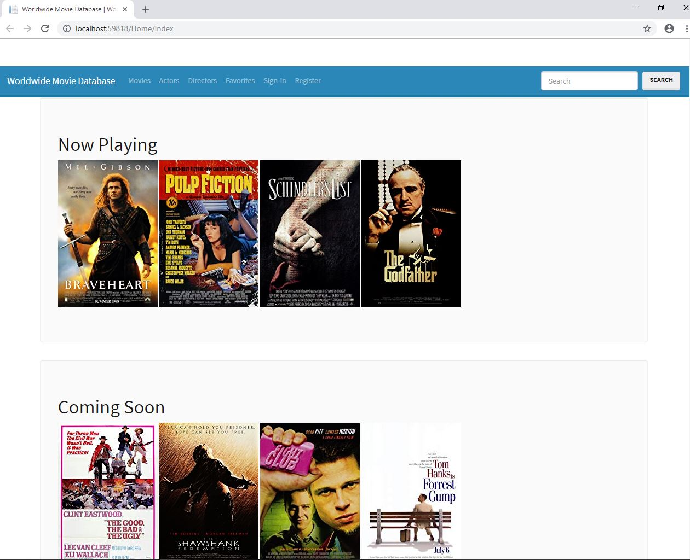

# Worldwide Movie Database
#### *A website hosting an online database storing information about movies and the movie industry.*

*Made using ASP.NET MVC 5*

#

#### FEATURES:

Homepage:
* View In Theaters/ coming soon
* Recommended movies
* View Events (film festivals, award ceremonies)

CRUD:
* CRUD Movies
* CRUD Profiles

Accounts:
* Administrator Accounts
* User Accounts
* User Registration
* Email
* Password

Functionality:
* Favorite Movies, Cast, Crew
* View Top Rated Movies, etc.
* 5 Star Rating System
* Rate Movies
* Rate Actors
* Rate Directors/Producers/Writers
	
Additional Features:
* Ad Placement
* Contact Information
* Trailers and Videos
